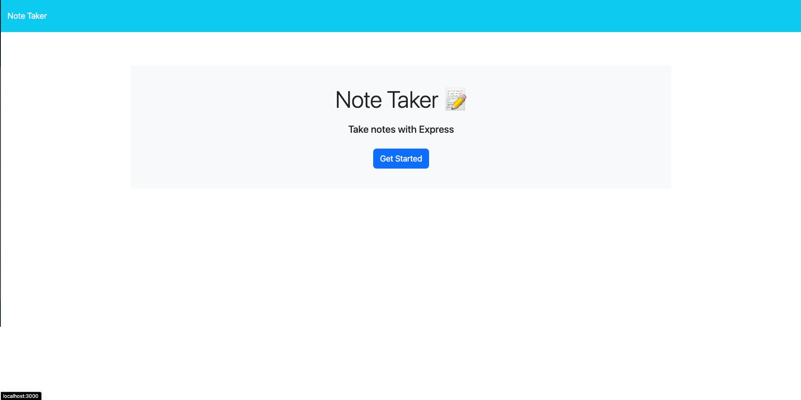
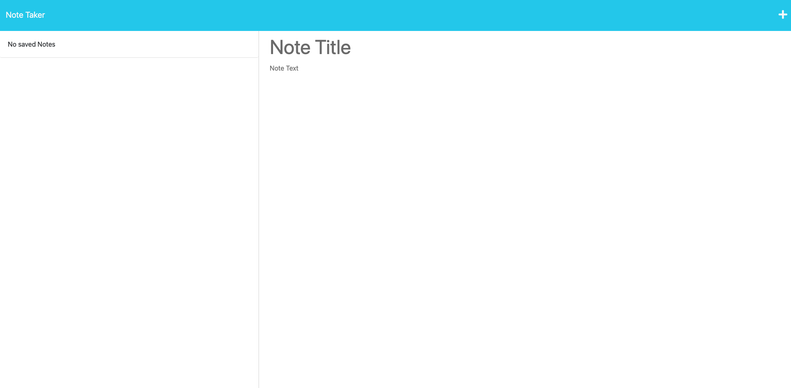

# Note-Taking App

## Table of Contents
- [Introduction](#introduction)
- [Features](#features)
- [Installation](#installation)
- [Usage](#usage)
- [API Endpoints](#api-endpoints)
- [Contribution](#contribution)
- [Screenshots](#screenshots)
- [License](#license)
- [Credits](#credits)

---

## Introduction
This is a simple yet powerful note-taking application built with Node.js and Express. It allows users to create, read, and delete notes, providing a smooth and efficient note management experience.

## Features
- Create new notes with a title and content.
- View all saved notes.
- Delete unwanted notes.
- Fast and efficient design for quick note access.

## Installation
1. Clone this repository to your local machine.
    \```
    git clone https://github.com/yourusername/notetaking-app.git
    \```
2. Navigate to the project directory.
    \```
    cd notetaking-app
    \```
3. Install the necessary packages.
    \```
    npm install
    \```
4. Start the application.
    \```
    npm start
    \```

## Usage
Navigate to `http://localhost:3000` to start using the application.

- To create a new note: Click on "New Note" and fill in the title and content.
- To save the note: Click on the "Save" button.
- To delete a note: Click on the "Delete" icon next to the note in the list.

## API Endpoints
- `GET /api/notes`: Retrieve all notes
- `POST /api/notes`: Create a new note
- `DELETE /api/notes/:id`: Delete a note by its ID

## Contribution
If you'd like to contribute, please fork the repository and create a pull request, or simply open an issue for things like bug reports, feature requests, etc.

## Screenshots



## License
This project is licensed under the MIT License. See `LICENSE.md` for more information.

## Credits
Built and maintained by Caldermoney.
